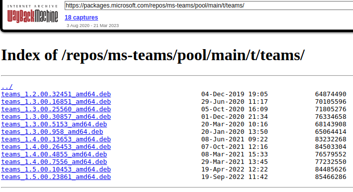
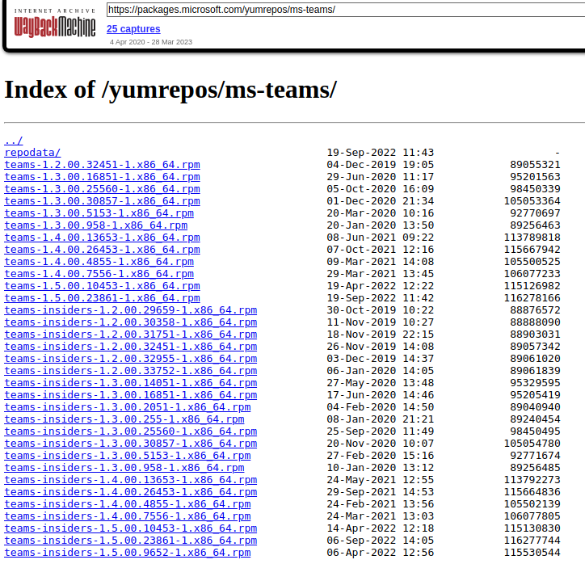

# Official Microsoft Teams client for Linux (preview)

As you probably know, Microsoft has discontinued it's Teams Electron-based desktop client for Linux.
Instead, they are proposing a [PWA (Progressive Web App) to be used](https://techcommunity.microsoft.com/t5/microsoft-teams-blog/microsoft-teams-progressive-web-app-now-available-on-linux/ba-p/3669846). Microsoft has also wiped their `teams` RPM/DEB repositories.

For me there are two downsides of using PWA:
* No tray icon
* Chrome/Edge browser core is always running in background

Good news for those, who (like me) would like to stick with the Electron app for as long as it would work - luckily I was able to obtain the latest packages from the Web Archive. You can download them on [release page](https://github.com/duhast/ms-teams-linux-official/releases) and install on your system.

Or, you can navigate to these two snapshots available on Web Archive (if they are still there) and download the packages there.

**[DEB Repo snapshot from 2022-12-03](https://web.archive.org/web/20221203104824/https://packages.microsoft.com/repos/ms-teams/pool/main/t/teams/)**

**[RPM Repo snapshot from 2022-11-30](https://web.archive.org/web/20221130114841/https://packages.microsoft.com/yumrepos/ms-teams/)**

---

